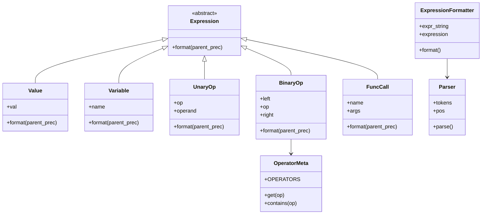

# Grokking Algorithms

Grokking Algorithms is a project designed to provide a comprehensive understanding of algorithms through practical examples and implementations in Python. This project aims to simplify complex algorithmic concepts and make them accessible to everyone.

## Installation

To install the necessary dependencies for this project, you can use the following command:

```bash
pip install -r requirements.txt
```

Alternatively, you can install the dependencies listed in `pyproject.toml` using:

```bash
pip install .
```

## Usage

To run the main application, execute the following command:

```bash
python src/grokking_algorithms/main.py
```

## Testing

To run the tests for this project, you can use the following command:

```bash
pytest tests/test_main.py
```
## Expression Formatter

The **Expression Formatter** is a Python utility for parsing and formatting mathematical and logical expressions. It converts an input string into a structured expression tree (AST), then outputs a string representation with correct parentheses based on operator precedence and associativity.

### Design Overview

The formatter uses an object-oriented approach with the following main components:

- **Expression (abstract base class):** All expression nodes inherit from this class and implement the `format()` method.
- **Value:** Represents literal numbers.
- **Variable:** Represents variable names.
- **UnaryOp:** Represents unary operations (e.g., `-a`, `abs(a)`).
- **BinaryOp:** Represents binary operations (e.g., `a + b`, `a * b`), handling precedence and associativity.
- **FuncCall:** Represents function calls with multiple arguments (e.g., `round(a + b, 2)`).
- **OperatorMeta:** Stores operator precedence and associativity.
- **Parser:** Converts a tokenized string into an expression tree.
- **ExpressionFormatter:** Main class that parses and formats expressions.

### Class Diagram



### Example Usage

```python
from src.grokking_algorithms.expression_formatter import ExpressionFormatter

expr = "a + b * c"
formatter = ExpressionFormatter(expr)
formatted = formatter.format()
print(formatted)  # Output: a + (b * c)
```

#### More Examples

| Input Expression         | Formatted Output         |
|-------------------------|-------------------------|
| `a * (b + c)`           | `a * (b + c)`           |
| `a ** b ** c`           | `a ** (b ** c)`         |
| `-abs(a - b)`           | `-(abs(a - b))`         |
| `round(a + b, 2)`       | `round(a + b, 2)`       |
| `a and b or c`          | `(a and b) or c`        |

### Features

- Parses and formats mathematical and logical expressions.
- Handles operator precedence and associativity.
- Supports unary and binary operators.
- Supports function calls with one or more arguments.
- Outputs expressions with minimal but correct parentheses.

### Possible Future Enhancements

- Support for custom operator definitions.
- Pretty-printing with indentation for complex expressions.
- Support for additional data types (e.g., strings, lists).
- Expression evaluation (not just formatting).
- Error highlighting and suggestions for invalid expressions.
- Integration with code editors for real-time formatting.

---

## Contributing

Contributions are welcome! Please feel free to submit a pull request or open an issue for any suggestions or improvements.

## License

This project is licensed under the MIT License - see the [LICENSE](LICENSE) file for details.